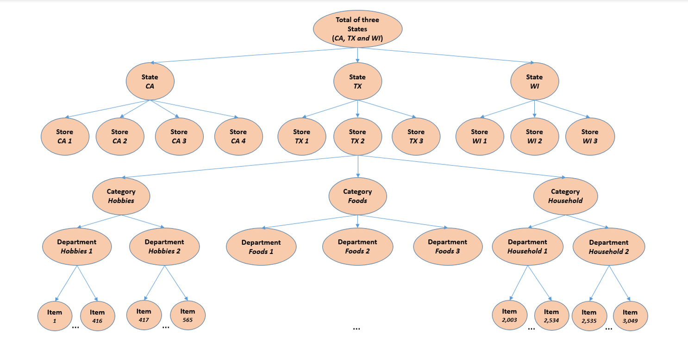

# Forcous : Estimating Unit Sales of Walmart Retail Goods
---
## Background of the competition
The Makridakis Competitions (also known as the M Competitions) are series of open competitions organized by teams led by forecasting researcher Spyros Makridakis and intended to evaluate and compare the accuracy of different forecasting methods. he first competition named M-Competition was held way back in 1982 with only 1001 data points, the complexity of the model and data scale increased with every successive iteration.

## Objectives
The objective of the M5 forecasting competition is to advance the theory and practice of forecasting by identifying the method(s) that provide the most accurate point forecasts for each of the 42,840 time series of the competition for 28 days ahead point forecasts. <br>
This competition aims to forecast daily unit sales for the next 28 days ie. till 22nd May 2016.

## Dataset
The dataset is made available by Walmart, one of the biggest retail corporation in the world. <br>
This dataset includes the unit sales of various products sold in the USA, organized in the form of grouped time series. <br>

<b>Detailed Breakdown</b> <br>
- The dataset involves the unit sales of 3,049 products classified in 3 product categories [Hobbies, Foods, Household] and 7 product departments in which the above 3 product categories are disaggregated.<br>
- The products are sold across 10 stores located in 3 states [CA, TX, WI].

<b> Hierarchical Item ordering </b>
</img>

<b> Number of Series per aggregation level </b> <br>
Level ID | Aggregation Level | Number of Series |
---------|-------------------|------------------|
1 | Unit sales of all products, aggregated for all stores/states | 1 |
2 | Unit sales of all products, aggregated for each State | 3 |
3 | Unit sales of all products, aggregated for each store | 10 |
4 | Unit sales of all products, aggregated for each category | 3 |
5 | Unit sales of all products, aggregated for each department | 7 |
6 | Unit sales of all products, aggregated for each State and category | 9 |
7 | Unit sales of all products, aggregated for each State and department | 21 |
8 | Unit sales of all products, aggregated for each store and category | 30 |
9 | Unit sales of all products, aggregated for each store and department | 70 |
10 | Unit sales of product x, aggregated for all stores/states | 3,049 |
11 | Unit sales of product x, aggregated for each State | 9,147 |
12 | Unit sales of product x, aggregated for each store | 30,490 |
13 | Total | 42, 840 |

```level_groupings = {2: ["state_id"], 3: ["store_id"], 4: ["cat_id"], 5: ["dept_id"], 
              6: ["state_id", "cat_id"], 7: ["state_id", "dept_id"], 8: ["store_id", "cat_id"], 9: ["store_id", "dept_id"],
              10: ["item_id"], 11: ["item_id", "state_id"]}
```
### The historical data range from 2011-01-29 to 2016-06-19. Thus, the products have a (maximum) selling history of 1,941  days / 5.4 years (test data of h=28 days not included). 

## Our Approaches
We will be building 4 models across various domains: <br>
- Probabilistic Naive Approach
- Time Series Modelling
- Machine Learning 
- Deep Learning

## Our Results

SNo | Approach | WRMSSE |
----|----------|--------|
1 | LightGBM | 0.49608 |
2 | FaceBook Prophet | 0.63419 |
3 | ARIMA | 0.78013 |  
4 | Stacked LSTM |  |
5 | Bidirectional LSTM | 1.05585 |
6 | 30 Days Average | 1.07118 | 
7 | LSTM | 2.19568 |
